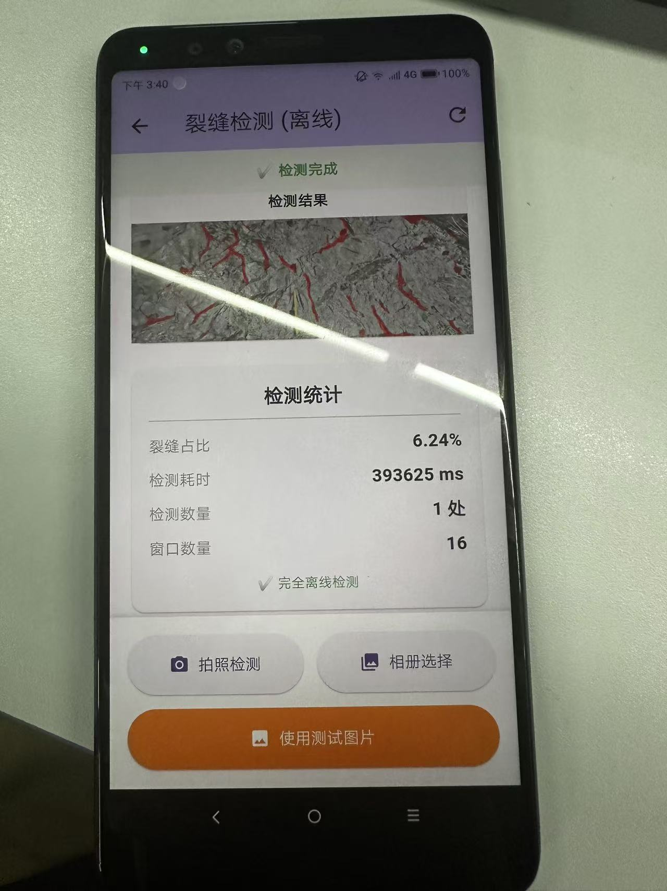
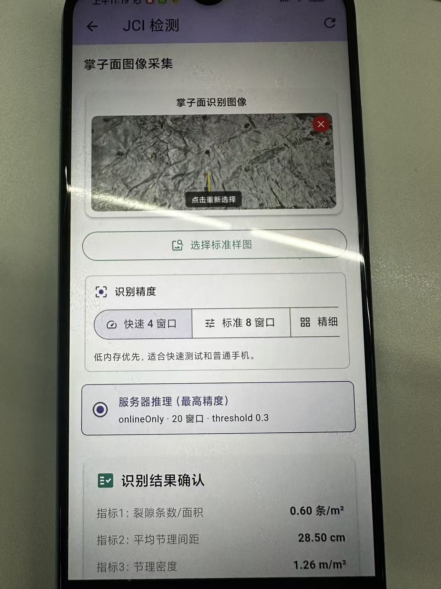
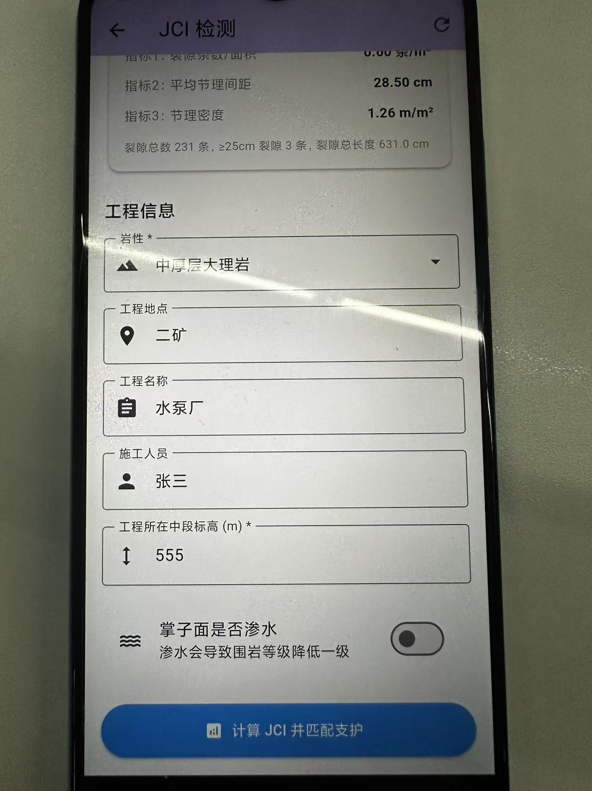
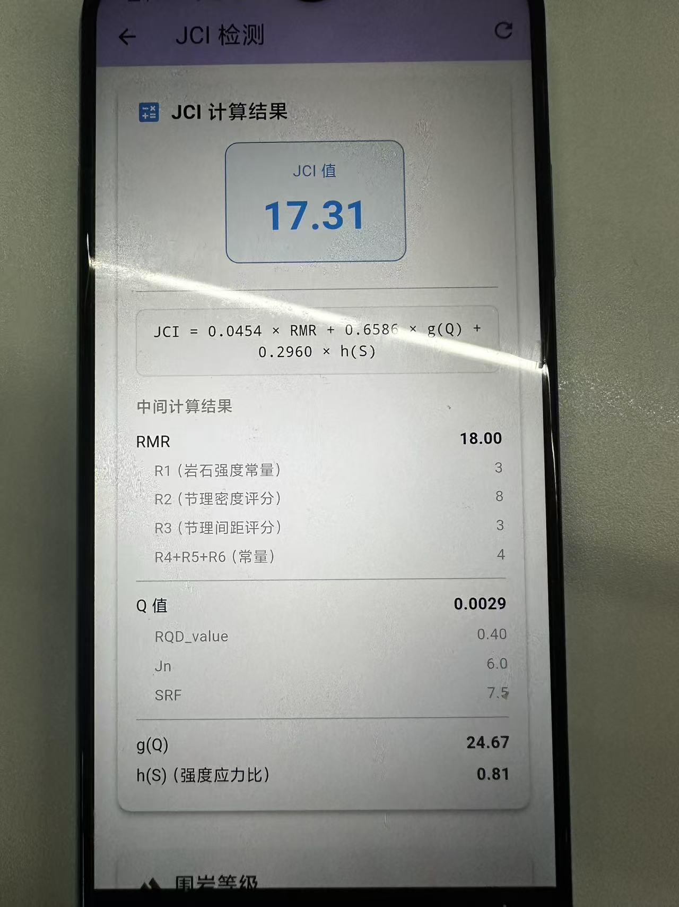

# 岩性自适应支护决策系统

面向矿山掌子面图像识别、JCI 参数计算、围岩等级判定和支护方案建议的
Flutter 移动端与 FastAPI 服务端项目。

## 开源发布说明

本仓库用于展示系统代码结构、移动端界面、服务端接口和成果截图。以下内容
不包含在开源仓库中：

- 预训练模型、模型权重和转换产物，例如 `.onnx`、`.pt`、`.ptl`、`.om`。
- 训练数据、校准数据、线上上传文件和历史 APK 构建产物。
- 私有服务器凭据、Cloudflare/SSH/Keycloak/MinIO 密码、签名 keystore。
- 本地 Codex 工作记录、临时导出、文档备份和构建缓存。

离线识别模型默认放置位置为 `assets/models/savss_256.onnx`。开源仓库只保留
模型目录说明，使用者需要自行准备兼容模型；联网场景也可以直接配置自己的
服务端推理入口。

## 功能概览

- 企业账号登录、注册、访客进入和离线使用。
- 掌子面图像采集，支持标准样图、相机拍摄和相册选择。
- 手机端离线识别与服务器推理（最高精度）两类入口。
- 裂隙识别结果确认、三大指标提取、JCI 计算和围岩等级判定。
- 支护方案建议、支护工艺明细、人工复核和人工调整。
- 检测报告生成、本地记录保存、联网同步和服务端报告查看。

## 成果截图

| 登录/注册 | 服务器推理 | JCI 计算 | 支护建议 |
| --- | --- | --- | --- |
|  |  |  |  |

更多公开展示图见 [docs/showcase](docs/showcase/README.md)。

## 项目结构

```text
lib/                    Flutter App 源码
server/                 FastAPI、MySQL、MinIO、Keycloak 服务端实现
assets/images/test/     公开测试样图
assets/models/          模型放置说明；不提交预训练模型
docs/api/               API 契约说明
docs/showcase/          公开成果截图
docs/reports/           本地生成说明书；默认不随开源提交
test/                   Flutter 单元测试和组件测试
server/tests/           服务端测试
```

## 运行移动端

准备 Flutter 3.35 或兼容版本后执行：

```powershell
flutter pub get
flutter run --flavor production -t lib/main_production.dart `
  --dart-define=CRACK_API_BASE_URL=http://127.0.0.1:8000
```

如果使用自己的公网 API，将 `CRACK_API_BASE_URL` 改成对应服务地址。

本地离线识别需要额外准备兼容 ONNX 模型：

```text
assets/models/savss_256.onnx
```

模型准备说明见 [MODEL_PREPARATION_GUIDE.md](MODEL_PREPARATION_GUIDE.md)。

## 运行服务端

服务端示例配置位于 `server/deploy/live/.env.example`。复制为 `.env` 后填入
自己的密码和部署地址：

```powershell
Copy-Item server\deploy\live\.env.example server\deploy\live\.env
```

开发测试可先运行：

```powershell
python -m pip install -r server\requirements.txt
python -m pytest server\tests -q
```

## 验证

推荐在发布前运行：

```powershell
flutter analyze
flutter test
python -m pytest server\tests -q
python -m compileall -q server\app server\scripts
```

## 许可证

公开发布前请由项目所有方确认最终开源许可证。本地整理阶段未擅自添加新的
`LICENSE` 文件。

## Evaluation Evidence

This repository includes a seed-gold evaluation scaffold under `evals/`.

- Plan: [`gold_testset_plan.md`](gold_testset_plan.md)
- Current results: [`EVAL_RESULTS.md`](EVAL_RESULTS.md)
- Latest machine-readable validation: [`evals/results/latest_seed_validation.json`](evals/results/latest_seed_validation.json)
- GitHub Actions: `Eval Seed Validation`
